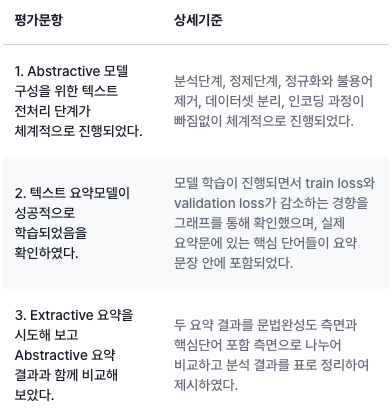

# Exploration 02 Project - News Summarization : 민혁, 고은비, 임만순

## 루브릭



평가문항 -> 상세기준

1. Abstractive 모델 구성을 위한 텍스트 전처리 단계가 체계적으로 진행되었다.
   - 분석단계, 정제단계, 정규화와 불용어 제거, 데이터셋 분리, 인코딩 과정이 빠짐없이 체계적으로 진행되었다.
2. 텍스트 요약모델이 성공적으로 학습되었음을 확인하였다.
   - 모델 학습이 진행되면서 train loss와 validation loss가 감소하는 경향을 그래프를 통해 확인했으며, 실제 요약문에 있는 핵심 단어들이 요약 문장 안에 포함되었다.
3. Extractive 요약을 시도해 보고 Abstractive 요약 결과과 함께 비교해 보았다.
   - 두 요약 결과를 문법완성도 측면과 핵심단어 포함 측면으로 나누어 비교하고 분석 결과를 표로 정리하여 제시하였다.

## 코더 회고

- 배운 점
  - 고은비: 자연어 처리를 이용해 불용어 제거와 요약문을 생성하는 방법을 이해할 수 있었다.
  - 민혁: 생각보다 모델 구현이 엄청 어려운 거라기보다는, 익숙하지 않을 뿐이었음을 깨달았다. 퍼실님들께 질문 한 번 하고 나니, 무언가 펑 뚫리는 기분이 들었다. 질문은 정말 소중한 것이다.
  - 임만순: Abstractive와 Extractive 요약의 차이점과 각각의 구현 방법을 배우며 모델 설계의 중요성을 배웠다.

- 아쉬운 점
  - 고은비: 모델에 대한 깊이 있는 이해가 부족해 프로세스를 정확히 파악하는 데 어려움이 있었다.
  - 민혁: 단지 그 깨달음이 너무 늦어졌을 뿐... 모델 저장 이슈가 버전 때문인 것도 알았고, 어떻게 모델을 로드해서 사용할지도 대충 알게 되었으나 시간이 부족하여 구현해보지는 못했다. 결국 Summa로 대충 때운 게 아쉽다.
  - 임만순: 요약 결과와 추상적 요약 결과의 차이를 좀 더 심층적으로 분석하지 못했다.

- 느낀 점
  - 고은비: 모델을 설계하고 실행하는 과정에서 스스로 생각하는 것이 얼마나 중요한지를 느꼈다.
  - 민혁: exploration에서 배운 내용을 차곡차곡 잘 정리하고 기억해서 아이펠톤 때 잘 활용할 수 있도록 해봐야겠다.
  - 임만순: 추상적 요약은 창의성이 요구되지만 동시에 모델 성능 평가가 어렵다.

- 어려웠던 점
  - 고은비: 처음에는 다소 갈팡질팡했지만, 시간이 더 있었다면 더 나은 결과를 얻을 수 있었을 것 같다.
  - 민혁: 대충 '맥락'은 알겠는데 아... 어떻게 구현하지? 싶었던 부분이 너무 많았다. 그리고 LMS 노드상에서 '훈련 모델'은 잘 구현해놓고, 도대체 왜 인퍼런스 모델에서 해당 모델에서 도출된 어떠한 값도 활용하지 않았는지 아직도 의문이다.
  - 임만순: 데이터셋의 불균형 문제를 처리하는 방법이 어려웠다.

## 피어리뷰 템플릿

🤔 피어리뷰 템플릿

- 코더: 고은비, 민 혁, 임만순
- 리뷰어: 강윤제, 윤석진, [김민규]

- [x]  **1. 주어진 문제를 해결하는 완성된 코드가 제출되었나요? (완성도)**
  - 문제에서 요구하는 최종 결과물이 첨부되었는지 확인
  - 문제를 해결하는 완성된 코드란 프로젝트 루브릭 3개 중 2개,
    퀘스트 문제 요구조건 등을 지칭
    - 해당 조건을 만족하는 부분의 코드 및 결과물을 캡쳐하여 사진으로 첨부  
     


- [x]  **2. 프로젝트에서 핵심적인 부분에 대한 설명이 주석(닥스트링) 및 마크다운 형태로 잘 기록되어있나요? (설명)**
  - [x]  모델 선정 이유
  - [x]  하이퍼 파라미터 선정 이유
  - [x]  데이터 전처리 이유 또는 방법 설명  
   


- [x]  **3. 체크리스트에 해당하는 항목들을 수행하였나요? (문제 해결)**
  - [x]  데이터를 분할하여 프로젝트를 진행했나요? (train, validation, test 데이터로 구분)
  - [x]  하이퍼파라미터를 변경해가며 여러 시도를 했나요? (learning rate, dropout rate, unit, batch size, epoch 등)
  - [x]  각 실험을 시각화하여 비교하였나요?
  - [x]  모든 실험 결과가 기록되었나요?  
   


- [x]  **4. 프로젝트에 대한 회고가 상세히 기록 되어 있나요? (회고, 정리)**
  - [x]  배운 점
  - [x]  아쉬운 점
  - [x]  느낀 점
  - [x]  어려웠던 점  
   


- [x]  **5.  앱으로 구현하였나요?**
  - [x]  구현된 앱이 잘 동작한다.
  - [x]  모델이 잘 동작한다.  
   [image](https://github.com/user-attachments/assets/c59abccf-9ed1-49ae-b0ef-62de4192acfb)


## 리뷰어 회고(참고 링크 및 코드 개선)

  

```Plaintext
강윤제 : 앱까지 구동된걸 보고 감명 깊었고 코드를 보니 진행하면서 서로 소통이 원활하고 의견 조율이 잘 된듯 하여 영감을 받고 갑니다.  
? :
? :
```
